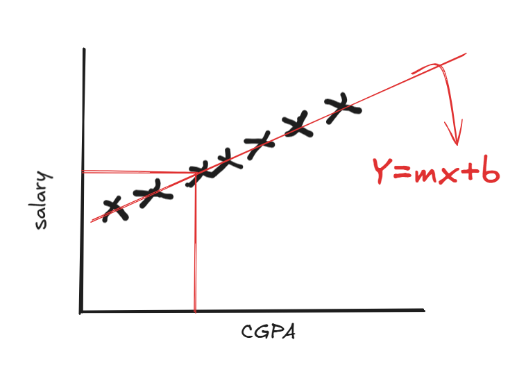
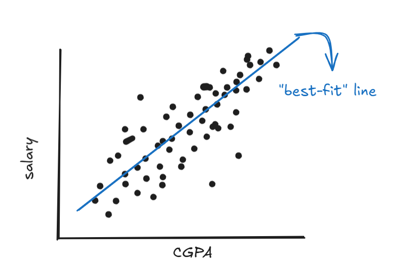

# Simple Linear Regression

## Overview
Linear regression is a foundational supervised machine learning algorithm and statistical technique used to predict a continuous outcome (dependent variable) based on one or more predictor features (independent variables).

## The Concept
Suppose we have a single-feature dataset where **CGPA** is the input variable ($x$) and **salary** is the target ($y$). If the data distribution were perfectly linear, we would use the standard line equation:

$$y = mx + b$$

Here, $m$ is the slope and $b$ is the y-intercept. In a perfect scenario, we could simply plug in the CGPA value to get the exact salary.



However, in the real world, data is rarely perfectly linear; it is usually only "sort of" linear. To handle this, we create a **"best-fit" line** through the data. We make predictions based on this line, aiming for the minimum possible prediction error rather than a perfectly accurate value. This strategy is called **Ordinary Least Squares (OLS)**.



To find this line, we must calculate the specific slope ($m$) and intercept ($b$) that minimize the distance between the line and our data points.


## The Error Function
If we consider the distance between a point and the line as an **error**, and we have $n$ points, the total error $E$ would be the sum of all distances. Since distances can be positive or negative (which would cancel each other out), we square them:

The distance $d$ is the difference between the actual value ($y$) and the predicted value ($\hat{y}$):
$$d_i = (y_i - \hat{y}_i)$$

Our Error Function (Cost Function) is:
$$E(m, b) = \sum_{i=1}^{n}(y_i - \hat{y}_i)^2$$
$$E(m, b) = \sum_{i=1}^{n}(y_i - mx_i - b)^2$$

## Derivation of Parameters

### 1. Solving for the Intercept ($b$)
To find the value of $b$ that minimizes the error, we take the partial derivative of $E$ with respect to $b$ and set it to zero:

$$\frac{\partial E}{\partial b} = \sum_{i=1}^n 2(y_i - mx_i - b)(-1) = 0$$

Dividing by $-2$ and distributing the summation:
$$\sum_{i=1}^n y_i - \sum_{i=1}^n mx_i - \sum_{i=1}^n b = 0$$

Since $m$ is constant and $\sum b$ added $n$ times is $nb$:
$$\sum y_i - m\sum x_i - nb = 0$$

Isolating $b$:
$$nb = \sum y_i - m\sum x_i$$
$$b = \frac{\sum y_i}{n} - m\frac{\sum x_i}{n}$$

Using the means ($\bar{y}$ and $\bar{x}$):
$$b = \bar{y} - m\bar{x}$$

### 2. Solving for the Slope ($m$)
Substituting the value of $b$ back into our error function:
$$E = \sum_{i=1}^{n}(y_i - mx_i - (\bar{y} - m\bar{x}))^2$$
$$E = \sum_{i=1}^{n}((y_i - \bar{y}) - m(x_i - \bar{x}))^2$$

Taking the partial derivative with respect to $m$:
$$\frac{\partial E}{\partial m} = \sum 2((y_i - \bar{y}) - m(x_i - \bar{x}))(-(x_i - \bar{x})) = 0$$

Simplifying and rearranging the terms:
$$\sum (y_i - \bar{y})(x_i - \bar{x}) - m \sum (x_i - \bar{x})^2 = 0$$

### Final Formula for Slope ($m$)
$$m = \frac{\sum_{i=1}^{n} (x_i - \bar{x})(y_i - \bar{y})}{\sum_{i=1}^{n} (x_i - \bar{x})^2}$$


## Conclusion
Using these two formulas for $m$ and $b$, we can calculate the best-fit line for any single-feature dataset, allowing us to predict Salary based on CGPA with the minimum possible total error.

## Python Code for Simple Linear Regression
```
class myLR:
    def __init__(self):
        self.m=None
        self.b=None
    def fit(self,X_train,y_train):
        num = 0
        den = 0
        
        for i in range(X_train.shape[0]):
            num = num + ((X_train[i] - X_train.mean())*(y_train[i]-y_train.mean()))
            den = den + ((X_train[i] - X_train.mean())*(X_train[i]-X_train.mean()))

        self.m = num/den
        self.b = y_train.mean() - (self.m * X_train.mean())
        print(self.m)
        print(self.b)
    def predict(self,X_test):
        return self.m * X_test + self.b
```

# 1. Initialize the model
lr = MyLR()

# 2. Train the model
lr.fit(X_train, y_train)

# 3. Make a prediction
prediction = lr.predict(X_test[0])
